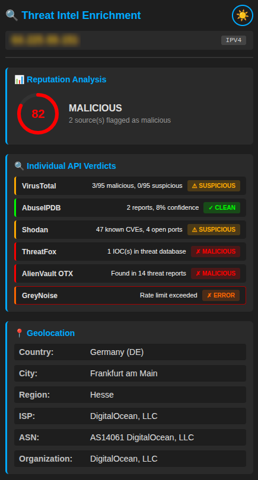
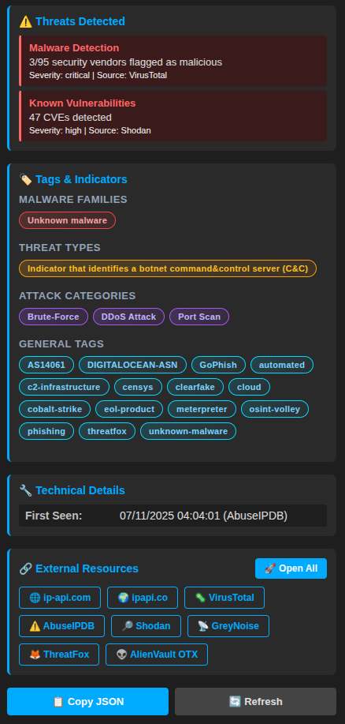
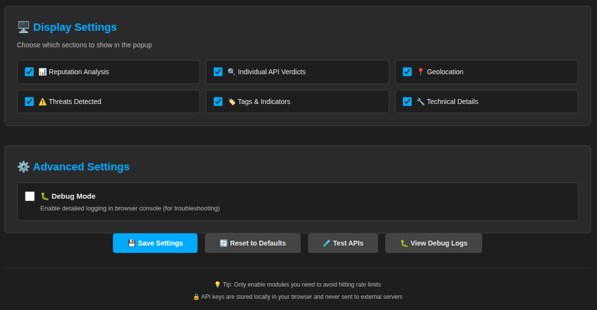

# 🛡️ IoCLens - SOC Threat Intel Enrichment

Firefox Extension (Manifest V3) to instantly enrich Indicators of Compromise (IOCs) during SOC investigations. Save time by aggregating multiple threat intelligence sources in one click.

## Features
- **Auto-Detection**: Recognizes IPv4 addresses and domains in selected text.
- **Contextual Menu**: Right-click → "Enrich IOC" to launch analysis.
- **Multi-Source Aggregation**: Pulls data from VirusTotal, AbuseIPDB, and more.
- **Privacy-First**: Zero telemetry. Requests are sent directly from your browser to providers.
- **PRO Features**: CSV export, priority support, and advanced sources (Shodan, GreyNoise, ...).

## 🚀 Get the Best Experience

While the core logic is open-source for transparency, the **Official Chrome Store version** is the recommended way to use IOCLens.

| Feature | Firefox Web Store (Official) TODO | Manual Clone (Dev Mode) |
| :--- | :---: | :---: |
| **Updates** | ⚡ **Automatic** | ❌ Manual (Must re-pull) |
| **Security** | ✅ **Verified by Google** | ⚠️ Self-audited |
| **PRO Sources** (Shodan, GreyNoise...) | ✅ **Included** | ❌ Not Available |
| **Advanced Export** (CSV/JSON) | ✅ **Yes** | ❌ No |
| **Priority Support** | ✅ **Yes** | ❌ Best effort |
| **Browser Compatibility** | Chrome, Brave, Edge, Opera | Experimental |

Buying a license is the best way to support the development of this tool and keep it privacy-first.

## Instructions

- **Get a free API key** on https://www.virustotal.com/
- **Set the key in settings**

## Screenshots

Pop-Up

Settings

